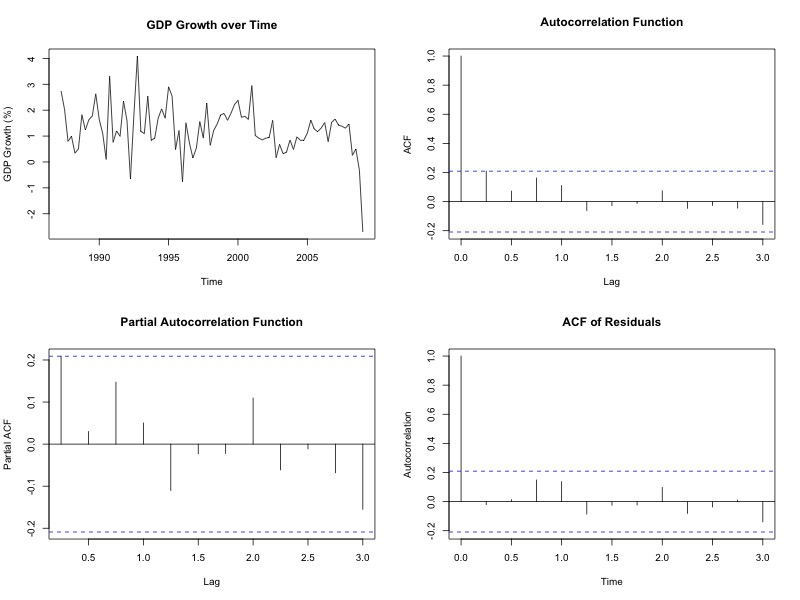

```{r setup, include=FALSE}
knitr::opts_chunk$set(echo = TRUE,  # Если мы не хотим код-чанков, можем менять на echo = FALSE
                      warning = FALSE,
                      message = FALSE,
                      out.width = "300pt", out.height = "200pt", 
                      fig.align = "center")

library(rio); library(tidyverse)
library(dynlm) ; library(stargazer)
library(normtest); library(reticulate)
library(AER)

```

<!-- I created a file .Renviron, where the python distribution is located on my system. You can find that by opening a terminal, and entering `$ which -a python python3`. Then, in RStudio, use `usethis::edit_r_environ()`, and add `RETICULATE_PYTHON="/Users/basmachielsen/opt/anaconda3/bin/python"` (or your directory) on a new line to the file. In this way, we can seamlessly interchange R and Python code chunks. Restart RStudio, and then everything is ready to go: --> 

## Question 1

**Part 1**

```{r echo = FALSE, out.width="400pt", out.height="300pt"}

```

```{r plotgdp}
# Part 1: Plot the Dutch GDP, ACF, and PACF
df <- readr::read_csv("./data/data_assign_p1.csv")

df <- ts(df$GDP_QGR, 
         frequency = 4, 
         start = c(1987, 2))
```

In the above figure, upper left, we observe the growth rates of Dutch GDP from 1987 to 2009. 

```{r plotacfpacf}
autoc <- acf(df, 
    lag.max = 12, plot = F) 

Box.test(df, 
         lag = 12, 
         type = "Ljung-Box")

pautoc <- pacf(df, 
     lag.max = 12, plot = F) 

```


In the above figure, we also plot the ACF and PACF, which is the ACF controlled for the other lagged correlations. The ACF tells us that the correlation of GDP growth with its lags is very low - hinting at very little time-dependence in this time-series. More precisely, the estimated correlation coefficients are not higher than 0.2 (for the lag of 1 period). If the GDP is indeed generated by an $AR(p)$ process, the estimates show that the process has low $\phi$'s (in absolute value), indicating a low time dependence. 

**Part 2**

```{r, results='asis'}
ar4 <- dynlm(df ~ L(df, 1) + L(df, 2) + L(df, 3) + L(df, 4))
ar3 <- dynlm(df ~ L(df, 1) + L(df, 3) + L(df, 4))
ar2 <- dynlm(df ~ L(df, 1) + L(df, 3))
ar1 <- dynlm(df ~ L(df, 1))

ar1_m <- forecast::Arima(df, c(1,0,0), method = "CSS")

stargazer(ar4, ar3, ar2, ar1, 
          type = "latex", header = FALSE,
          font.size = "small", column.sep.width = "0pt",
          omit.stat = c("adj.rsq", "ser", "f"))

```

The table below shows us the coefficients of the $AR(p)$ models with 1 to 4 lags included. Using a general-to-specific approach, we eliminate insignificant lags ($\alpha = 0.05$ level) at each step. Column (1) shows that only the first lag is significant at the 0.1 level. The second lag has the lowest $\psi$ coefficient and the highest s.e., thus, we eliminate it first. Doing this iteratively, we are left with the first lag in the model which is significant at the 0.05 level. Investigating the coefficient, we observe there is a 1-period persistence of the time series on its lagged value. The _degree_ of persistence, however, is not large, as the magnitude of the coefficient is fairly small (0.26). 

**Part 3**

In the fourth plot above, we show the autocorrelation of the residuals. We observe that none of the coefficients attain significance. Hence, we think that the model is well-specified. Formally, we compute the Durbin-Watson test statistic, of which the output is shown below. The null hypothesis of no autocorrelation is not rejected. In an unreported plot, we also investigate the _partial_ autocorrelation of residuals, in which there is also no sign of autocorrelation. 

```{r}
durbinWatsonTest(ar1)

autocred <- acf(ar1_m$resid, 12, 
                plot = FALSE)
```

<!--```{r figure, echo = FALSE}-->
```{r 4plot, include = FALSE, echo = FALSE, warning = FALSE, message = FALSE}
jpeg("./plot.jpeg", height = 600, width = 800) 

par(mfrow=c(2,2))

plot(df, 
     xlab = "Time", 
     ylab = "GDP Growth (%)", 
     main = "GDP Growth over Time")

plot(autoc, 
     main = "Autocorrelation Function")

plot(pautoc, 
     main = "Partial Autocorrelation Function")

plot(autocred, main = "ACF of Residuals", 
           xlab = "Time", 
           ylab = "Autocorrelation")

dev.off()
```

**Part 4**

```{r}
# Part 4: Forecast AR model for 2 years
df_pred <- predict(ar1_m, n.ahead = 8)$pred
```

We derived the forecasts by making use of the conditional expectation as the forecast minimizing the forecast error under quadratic loss. The conditional expectation of the forecast for $T+1$ is: $\mathbb{E}[X_{T+1} | X_1, \dots, X_T] = \mathbb{E}[\phi X_T + \alpha + \epsilon_{T+1} | X_1, \dots, X_T] = \phi X_T + \alpha$. Similarly, the forecast for $T+2$ equals $\phi \mathbb{E}[X_{T+1} + \alpha] = \phi (\alpha + \phi X_T) + \alpha$. Generalizing this pattern, we then end up with the following recursive forecasts (for $j > 1$):

$$
\mathbb{E}[X_{T+j}] = \alpha + \alpha \cdot \left( \sum_{i = 1}^{j-1} \phi^i \right) + \phi^j X_T
$$

**Part 5**

We construct the forecasts using a 95% symmetric confidence interval around the forecast. 

```{r}
# Part 5: Produce CI
phi <- ar1_m$coef[1]
sigma <- sqrt(ar1_m$sigma2)

df_ciu <- predict(ar1_m, n.ahead = 8)$pred + predict(ar1_m, n.ahead = 8)$se*1.96
df_cil <- predict(ar1_m, n.ahead = 8)$pred - predict(ar1_m, n.ahead = 8)$se*1.96
```

We can reproduce the forecasts manually by using a standard confidence interval around the aforementioned predicted value, $CI(\mathbb{E}[X_{T+j}]) = \alpha + \alpha \cdot \left( \sum_{i = 1}^{j-1} \phi^i \right) + \phi^j X_T \pm 1.96 \cdot \sigma$, where $\sigma^2_j = \sigma^2_{\epsilon} \cdot (1 + \phi^2 + \dots + \phi^{2(j-1)})$. 

**Part 6**

We check for normality of the residuals using the Jarque-Bera test: 

```{r}
jb.norm.test(ar1_m$resid)
```

According to the test, we have to reject H0, indicating that normality of the innovations is violated. In the figure below, we plot the forecasts (green, CIs in red) next to the actual data (black). 

```{r, message = FALSE, warning = FALSE}
true <- ts(c(0.49, -0.31, -2.7, -1.63, 0.28, 0.33, 0.66, 1.59, 0.51, 0.71, 0.81), 
         frequency = 4, 
         start = c(2009, 2))

data <- data.frame(date = as.Date(time(true)), 
           actual_values = as.matrix(true),
           prediction = c(rep(NA,3), as.matrix(df_pred)),
           upper = c(rep(NA,3), as.matrix(df_ciu)),
           lower = c(rep(NA,3),as.matrix(df_cil)))

data %>%
  ggplot(aes(x = date)) + geom_line(aes(y = actual_values)) +
  geom_line(aes(y = upper), color = "red", lty = "dashed") +
  geom_line(aes(y = lower), color = "red", lty = "dashed") +
  geom_line(aes(y = prediction), color = "green", lty = "dashed") +
  ylab("Values") + xlab("Date") +
  ggtitle("Actual and Predicted GDP series")

```

The forecasts show a tendency to revert to the mean of the AR process, which happens quite quickly after the drop. The drop has thus only a small effect on the forecasts. On the other hand, the limited $T$ makes that the confidence bounds are quite large: on the one hand, all realized values fall within the 95% confidence bounds, which is a sign of accuracy, but on the other hand, the standard errors of the estimates are quite large, making the estimates less informative and perhaps less useful to policy makers. 

\clearpage

## Question 2

**Part 1**

```{r, echo = FALSE, message = FALSE, warning = FALSE}
# Get the data
df2 <- readr::read_csv("./data/data_assign_p2.csv")

df2 <- ts(df2[,2:3], 
         frequency = 4, 
         start = c(1987, 2))
```

First, we plot the unemployment and GDP series. 

```{r plot}
plot(df2)
```

Second, we estimate the AR-models:

```{r}
# Part a: Plot the Dutch GDP/unemployment, AR and ADL
ar4 <- dynlm(df2[,1] ~ L(df2[,1], 1) + L(df2[,1], 2) + L(df2[,1], 3) + L(df2[,1], 4))
ar3 <- dynlm(df2[,1] ~ L(df2[,1], 1) + L(df2[,1], 3) + L(df2[,1], 4))
ar2 <- dynlm(df2[,1] ~ L(df2[,1], 1) + L(df2[,1], 3))

```

Thirdly, we implement the general-to-specific approach for the ADL in R:

```{r generaltospecific}

recursive_reg <- function(dataset, equation){
  
  initial_reg <- dynlm(formula = as.formula(equation), data = dataset)
  
  p_values <- initial_reg %>%
    summary() %>%
    .$coefficients %>%
    .[,4]
  
  while(max(p_values) > 0.05){
    
    variable_drop <- which.max(p_values) %>%
      labels()
    
    equation <- equation %>%
      str_c("-", fixed(variable_drop))
    
    # reestimate the model and print the results
    initial_reg <- dynlm(formula = as.formula(equation), data = dataset)
    
    p_values <- initial_reg %>%
    summary() %>%
    .$coefficients %>%
    .[,4]
    
    print(summary(initial_reg))
  }
    
  initial_reg
  
}

```

```{r results='hide'}
recursive_reg(dataset = df2, equation = 'UN_RATE ~ L(UN_RATE, 1) + 
              L(UN_RATE, 2) + L(UN_RATE, 3) + L(UN_RATE, 4) +
              L(GDP_QGR, 0) + L(GDP_QGR, 1) + L(GDP_QGR, 2) +
              L(GDP_QGR, 3) + L(GDP_QGR, 4)')
```


